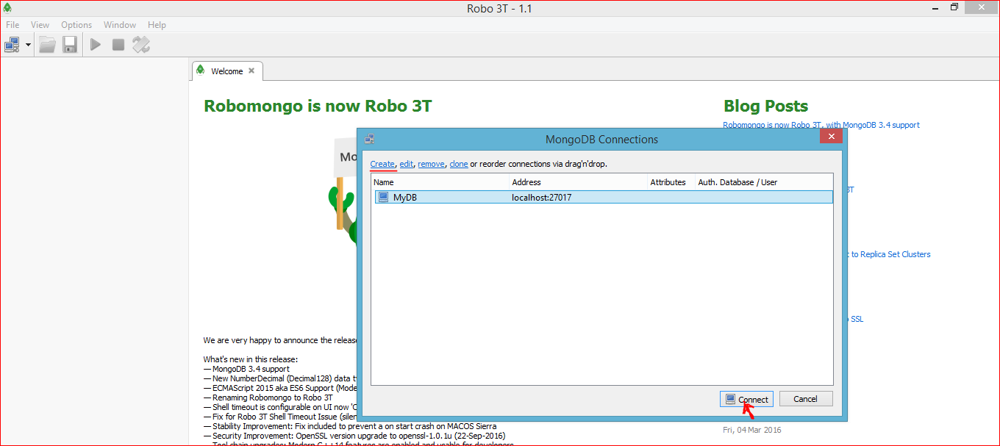
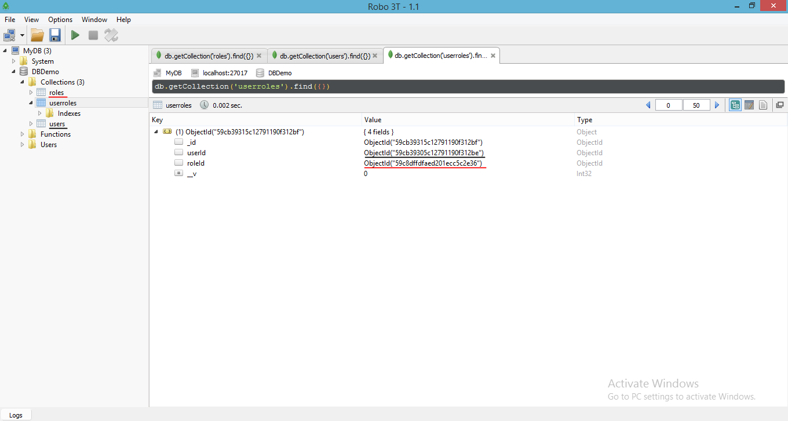
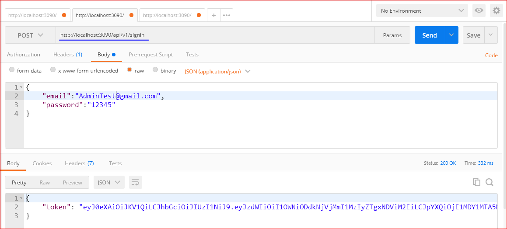
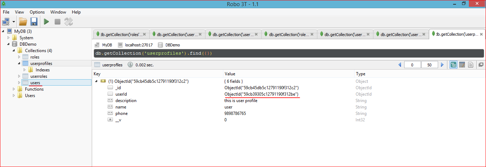

# React Api server
React API server based on node.js, express.js, mongodb including json web token and passport.js authentication for user access and roles.

# installation
### install npm for install packages locally
```bash
//install missing packages using npm install from your project directory path
>npm install
>nodemon (run express server)
```


# Create data/db folder inside your project directory and run following command
```bash
"C:\Program Files\MongoDB\Server\3.4\bin\mongod.exe" --dbpath "your-data/db path"
```


You can choose path as per your local configuration of mongodb. Open mongodb using Robo 3T.
Robo 3T embeds the actual mongo shell in a tabbed interface with access to a shell command line as well as GUI interaction.

If you want to create new one then click on create otherwise just click on connect.



## config.json
```json
{
   "dbUri": "mongodb://localhost:27017/DBDemo",
    "secret": "a secret phrase!!"
}
```
"dbUri" contains "mongodb" who define that we are using mongodb for handling database, localhost:27017 for access MongoDB over HTTP on the native driver port and DBDemo is the name of database. You can also change the database name as per your requirement.

# Directory structure
```bash
react-api-server
          |-- data
          |     |--db
          |--react-api-server
          |     |--config
          |     |--controllers
          |     |--models
          |     |--routes
          |     |--image
          |     |--services
          |     |--.gitignore
          |     |--index.js
          |     |--package.json
          |     |--README.md
```
# Call API via postman using route path

Before moving with signup, first create demo roles(in demo I am taking parent and admin) in role collection.

```bash
1 http://localhost:3090/api/v1/role
```


We defined '/role' in routes/roleRouter.js and you can see some routes are having 'requireAuth' which are restricted. In this example I did not restrict access of '/role'. You can make changes as per need.

Variable 'requireAuth' is used to access authorized API only. If you want to access some API without authentication then don't plug 'requireAuth' in route access. You can see the Authorized API call in userProfile section.


```bash
2 http://localhost:3090/api/v1/signup
```
Collection "user" contains email, password fields. Signup api requires {email, password, role}.


To verify check 'user' collection for created user's documents.


Collection "userRoles" contains userId,roleId. In that userId is reference of user.id (ObjectId type) and roleId is reference of role.id (ObjectId type).


# Signin
User email and password for signin api call and it will return the access token.
```bash
3 http://localhost:3090/api/v1/signin
```


For other collections token authorization is required.

"userProfile" having userId,description,Name,Phone. userId is the reference of user-ObjectId.
when we create userProfile we need to pass token as follow:-
```bash
4 http://localhost:3090/api/v1/userProfile
```




# Usage
In model we define schema and all schema registered into index.js

```bash
models/index.js

const mongoose = require('mongoose');
module.exports.connect = (uri) => {
  mongoose.connect(uri);
  // plug in the promise library:
  mongoose.Promise = global.Promise;
  mongoose.connection.on('error', (err) => {
    console.error(`Mongoose connection error: ${err}`);
    process.exit(1);
  });
//console.error(`Mongoose connection`);
  // load models

require('./roleModel');
require('./userModel');
require('./userRolesModel');
require('./userProfileModel');

};
```

```bash
model/userModel.js

userSchema.pre('save', function saveHook(next) {

  // get access to the user model
  const user = this;
  // generate a salt then run callback
  bcrypt.genSalt(10, function(err, salt) {
    if (err) {
    return next(err);
  }
        // hash (encrypt) our password using the salt
    bcrypt.hash(user.password, salt, null, function(err, hash) {
        if (err) {
        return next(err);
      }
        // overwrite plain text password with encrypted password
      user.password = hash;
        next();
      });
  });
});
```
UserSchema.pre('save') that will be executed before saving. In this method, the bcrypt module will generate a hash from a generated earlier salt string and a user’s password. This hash instead of a user’s password will be saved in the collection.

```bash
//overwrite plain text password with encrypted password
 user.password=hash;
```

This generation will be executed only if it’s a new document or the password field has been changed:
 user.isModified('password').

The schema also contains a method UserSchema.methods.comparePassword to verify user password before generating access token.
```bash
userSchema.methods.comparePassword = function comparePassword(candidatePassword, callback) {
  bcrypt.compare(candidatePassword, this.password, function(err, isMatch) {
    if (err) { return callback(err); }

    callback(null, isMatch);
  });
}
```
```bash
function tokenForUser(user,_role) {
      const timestamp = new Date().getTime();
      return jwt.encode({ sub: user.id, iat:timestamp,role:_role }, config.secret);
}
```
Access token contain user id and role, which you can change in tokenForUser function. In demo we are passing userid and role name with timestamp. To check information embeds in access token https://jwt.io/. In that you simply need to paste token in encoded area and it will display headed and payload data.
