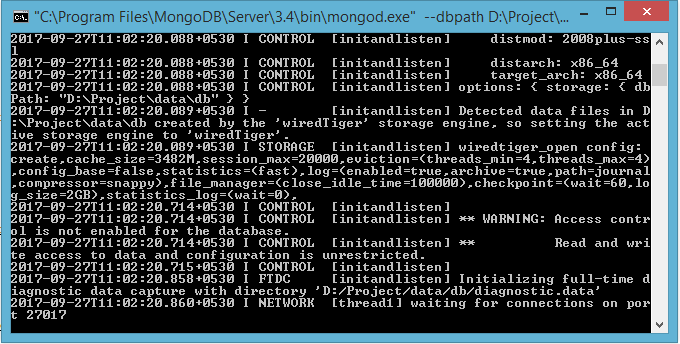
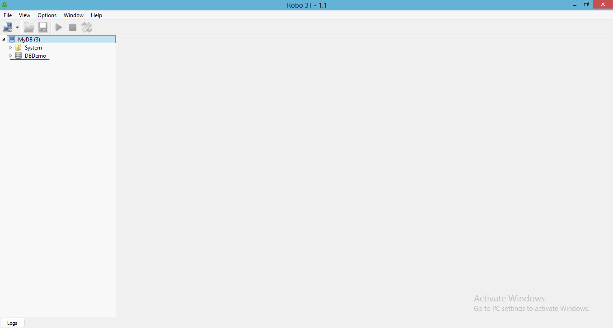
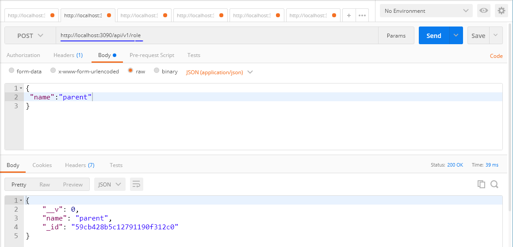
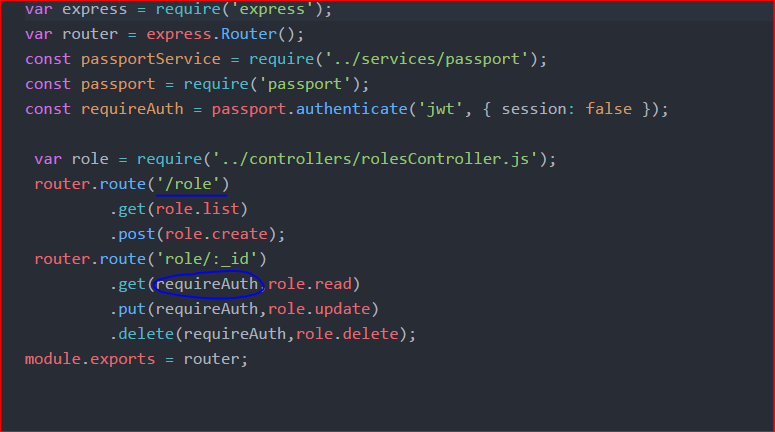
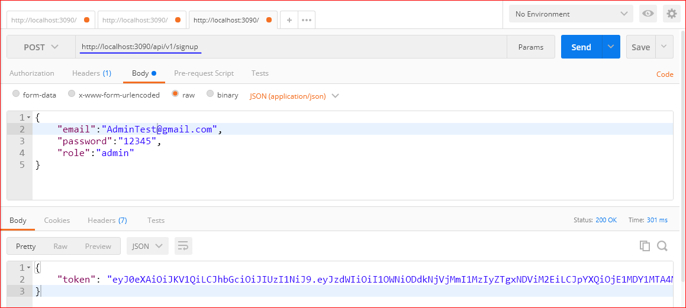
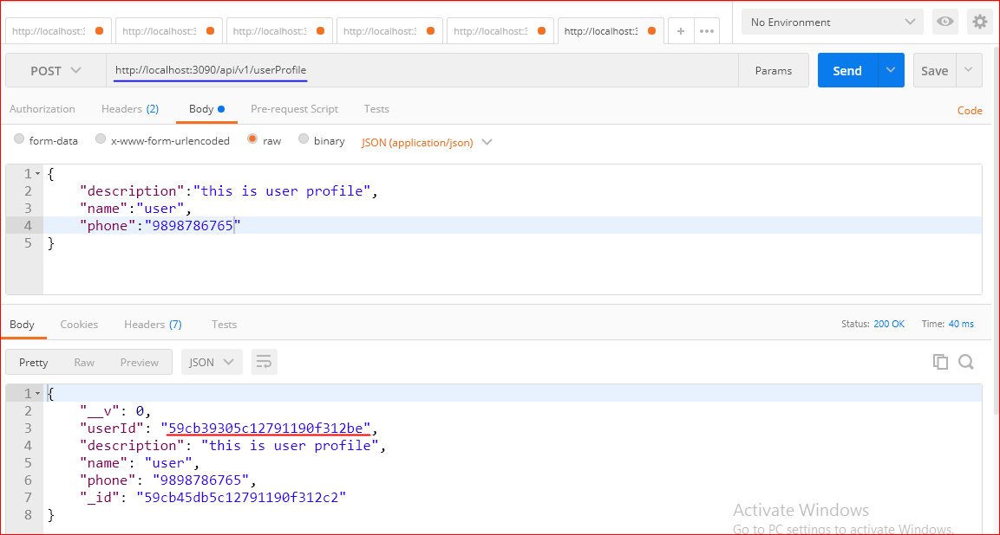

# react-api-server
React API server based on node.js, express.js, mongodb including json web token and passport.js authentication for user access and roles.

# installation
### install npm for install packages locally
```bash
//install npm and nodemon from your project directory path
>npm install
>nodemon
```
nodemon will automatically restart our server application whenever a code change happens.


# create data/db folder inside your project directory and run following command
```bash
"C:\Program Files\MongoDB\Server\3.4\bin\mongod.exe" --dbpath "your-data/db path"
```




It will automatically create database as per name we mentioned DBDemo.You can check in Robo 3T.
Robo 3T embeds the actual mongo shell in a tabbed interface with access to a shell command line as well as GUI interaction.
If you want to create new one then click on create otherwise just click on connect.




## config.json
```json
{
   "dbUri": "mongodb://localhost:27017/DBDemo",
    "secret": "a secret phrase!!"
}
```
"dbUri" contains "mongodb" who define that we are using mongodb for handling database, localhost:27017 for access MongoDB over HTTP on the native driver port and DBDemo is the name of database. You can also change the database name as per your requirement.
# Directory structure
```bash
react-api-server
          |-- data
          |     |--db
          |--react-api-server
          |     |--config
          |     |--controllers
          |     |--models
          |     |--routes
          |     |--image
          |     |--services
          |     |--.gitignore
          |     |--index.js
          |     |--package.json
          |     |--README.md
```
# call API via postman using route path

For signup we need to create role first."role" collection having name field who define the roles.we are using "admin" and "user" role here.
```bash
http://localhost:3090/api/v1/role
```


Here we use /role route. This route defined in routes/roleRouter.js. As we can see /role route is used to access the API and requireAuth is used to access authorized API only. If you want to access some API without authentication then you can directly call that API. you can see the Authorized API call in userProfile section.




```bash
http://localhost:3090/api/v1/signup
```
"user" collection having email,password fields.For signup email,password and role. You can see the collection created in robo 3T.



"userRoles" contains userId,roleId. In that userId is reference of user-ObjectId and roleId is reference of role-ObjectId.


# signin
signin having email and password credentials and it will return the token.


For other collections token authorization is must.
"userProfile" having userId,description,Name,Phone. userId is the reference of user-ObjectId.
when we create userProfile we need to pass token as follow:-





# Usage
In model we define schema and all schema registered into index.js
```bash
const mongoose = require('mongoose');
module.exports.connect = (uri) => {
  mongoose.connect(uri);
  // plug in the promise library:
  mongoose.Promise = global.Promise;
  mongoose.connection.on('error', (err) => {
    console.error(`Mongoose connection error: ${err}`);
    process.exit(1);
  });
//console.error(`Mongoose connection`);
  // load models

require('./roleModel');
require('./userModel');
require('./userRolesModel');
require('./userProfileModel');

};
```
```bash
userSchema.pre('save', function saveHook(next) {

  // get access to the user model
  const user = this;
  // generate a salt then run callback
  bcrypt.genSalt(10, function(err, salt) {
    if (err) {
    return next(err);
  }
        // hash (encrypt) our password using the salt
    bcrypt.hash(user.password, salt, null, function(err, hash) {
        if (err) {
        return next(err);
      }
        // overwrite plain text password with encrypted password
      user.password = hash;
        next();
      });
  });
});
```
UserSchema.pre('save') that will be executed before saving. In this method, the bcrypt module will generate a hash from a generated earlier salt string and a user’s password. This hash instead of a user’s password will be saved in the collection.

```bash
//overwrite plain text password with encrypted password
 user.password=hash;
 ```

This generation will be executed only if it’s a new document or the password field has been changed:
 user.isModified('password').

The schema also contains a method UserSchema.methods.comparePassword that we will call if we want to check if a user has provided a correct password.
```bash
userSchema.methods.comparePassword = function comparePassword(candidatePassword, callback) {
  bcrypt.compare(candidatePassword, this.password, function(err, isMatch) {
    if (err) { return callback(err); }

    callback(null, isMatch);
  });
}
```
```bash
function tokenForUser(user,_role) {
      const timestamp = new Date().getTime();
      return jwt.encode({ sub: user.id, iat:timestamp,role:_role }, config.secret);
}
```
This will create token for user. token encoded by header (algorithm and token type),payload (data) and signature. The signature part contains an encoded header, a payload, and a secret key phrase.
